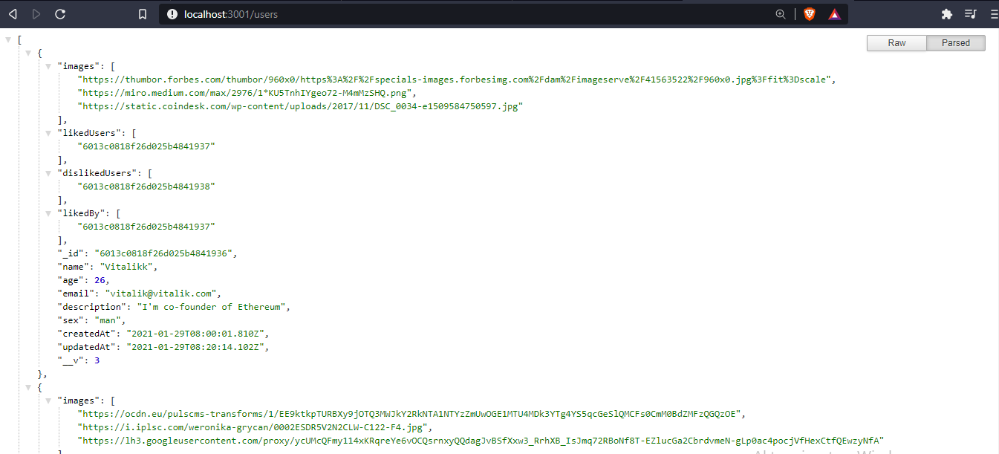
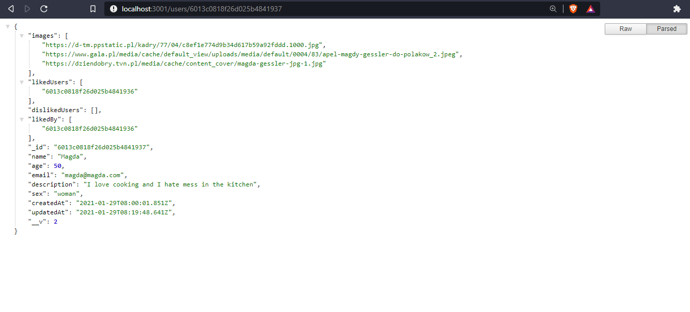

# Meet App
Back-end part of the Meet App project.

Tech stack:
* Node.js
* Express.js
* MongoDB
* JSON Web Tokens

[Here you can find the Front-end part](https://github.com/piotrstepak/meet-app-front)

Meet App is build on the MERN stack and its principle of operation is similar to the popular Tinder app, i.e. 
it is an application that allows you to meet new people.

### Important
The project is under development and work on it is temporary suspended, 
it is not yet deployed and it currently works on localhost, due to the privacy of the MongoDB 
access key it is not possible to run the application locally after cloning repository.

## Progress summary
Prepared Endpoints (data is returned in JSON):

* get all users

* get specific user

* add user
* delete user
* update user
* register
    * the password is secured with salt
* register mock
    * used to register mocked user
    
Endpoints with access via JWT:
* login
* get next user to display in app
* get matches 
    * an array of users we're matching in app
 
 
 ## Future plans
 * add admin panel
 * secure all private endpoints via JWT
 